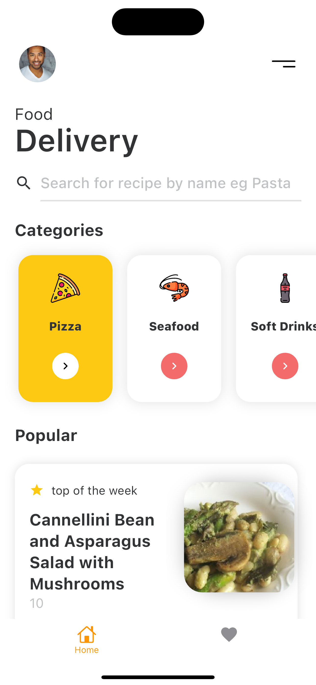
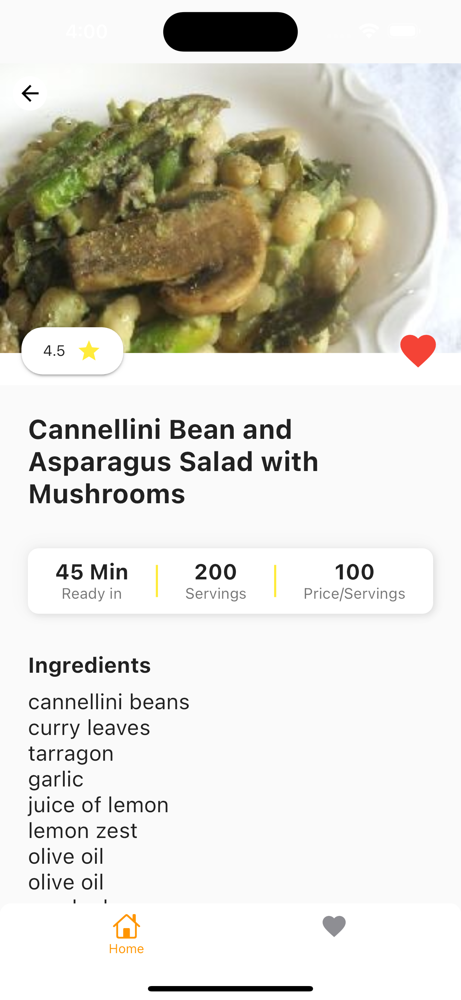
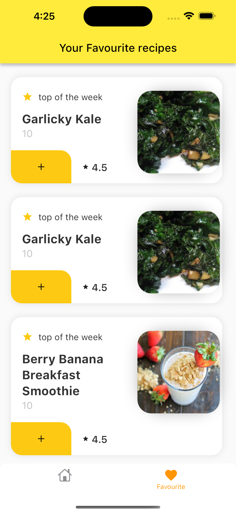
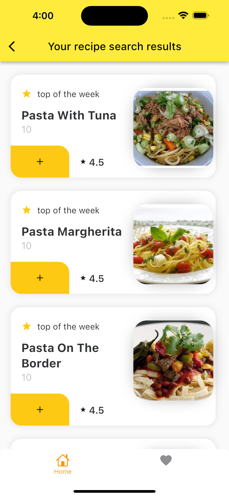

# yahaal_test

A new Flutter project.

## Getting Started

This project is a starting point for a Flutter application.

A few resources to get you started if this is your first Flutter project:

- [Lab: Write your first Flutter app](https://docs.flutter.dev/get-started/codelab)
- [Cookbook: Useful Flutter samples](https://docs.flutter.dev/cookbook)

For help getting started with Flutter development, view the
[online documentation](https://docs.flutter.dev/), which offers tutorials,
samples, guidance on mobile development, and a full API reference.

## App Features.

- A Search for recipes
- mark recipes as favourite
- view recipes information

## Error handling.
 i handled error using the [dartz](https://pub.dev/packages/dartz) library, which is a functional programing library that helps you to handle error types


## App Information
Here,i created this app with the completion of the technical challange for **Yahaal** flutter developer job, in this app you can view a list of recipes, search, recipes by name and mark recipe as favourite

## UI challanges and choice of Design
Well the only challange i faced was trying to choose a good design that will be very easy as well, i had a lot of options to choose from which was not really easy to decide on at first.


## Tools use
in this application i used Flutter bloc for state managemen, and dio for http request and i also imployed clean architecture to make the code easy to understand and easy to scale, i also followed SOLID principle


<p align="center">





</p>

## How to use

```
# Clone this repository
$ git clone https:https://github.com/OnyemaAnthony/yahaal_test.git

# Go into the repository
$ cd yahaal_test

# Install dependencies
$ flutter packages get

# Run the app
$ flutter run

# Run the app
$ Run tests to ensure features are working fine
```

